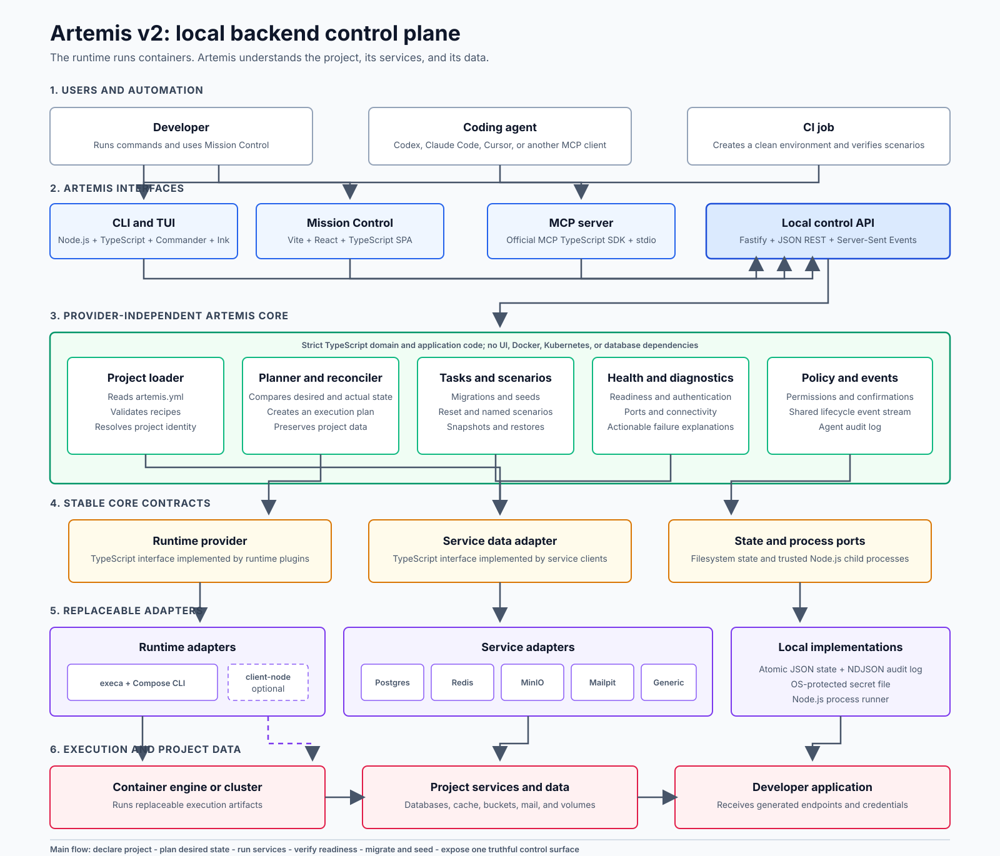
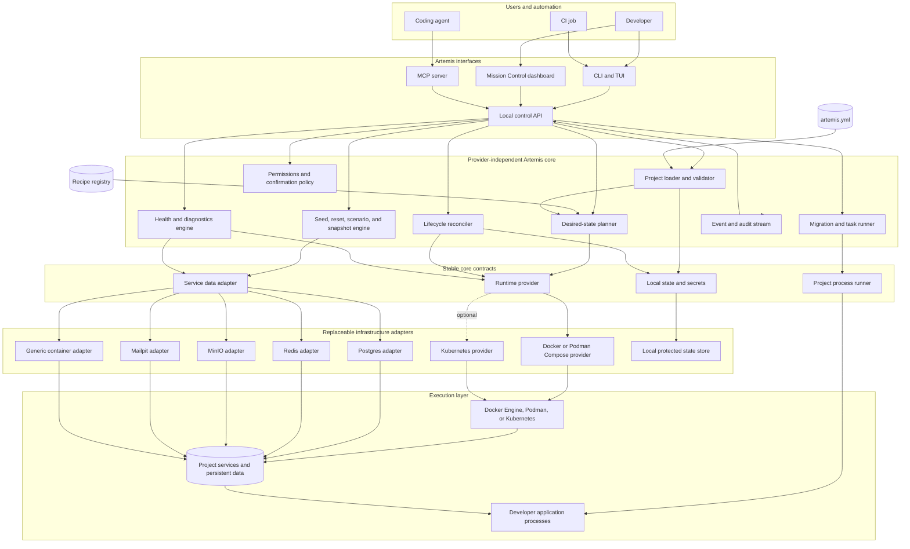
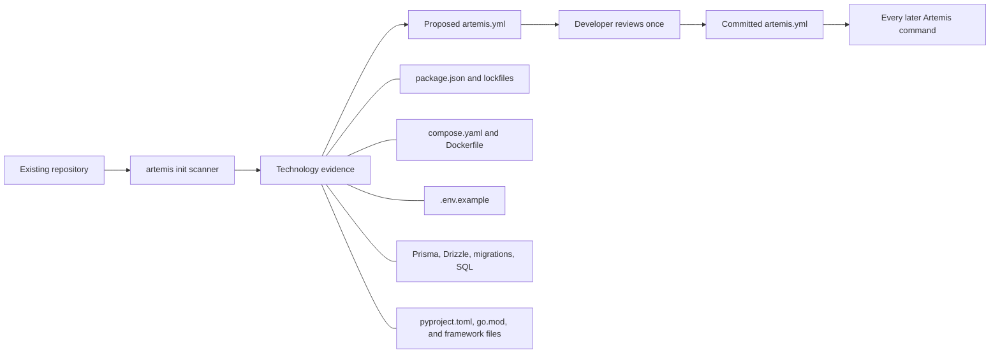
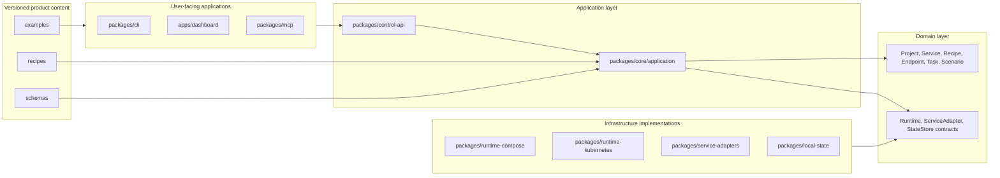
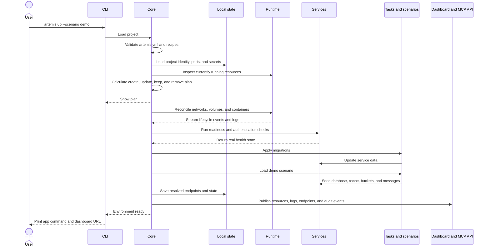

# Artemis v2 Architecture

Status: proposed architecture for the next major version.

This document describes the product Artemis is intended to become. It is not a
description of the current v1 implementation.

## Product model

Artemis is a project-scoped control plane for local backend dependencies. It
turns a repository's declared infrastructure into a reproducible environment,
then gives developers, CI jobs, and coding agents the same safe interface for
starting, inspecting, resetting, and diagnosing that environment.

The shortest useful description is:

> The runtime runs containers. Artemis understands the project and its data.

Docker Compose remains responsible for container execution. Artemis owns the
higher-level workflow: service recipes, project isolation, generated
connections, readiness, migrations, seed data, scenarios, diagnostics, and
safe agent access.

## System architecture

The standalone visual can be opened directly in any browser:
[artemis-v2-architecture.svg](./artemis-v2-architecture.svg).





### How to read this diagram

1. A person, CI job, or coding agent uses a different interface, but all
   interfaces call the same local control API.
2. The core reads `artemis.yml` and recipes, calculates the desired project
   environment, and reconciles it with what is actually running.
3. The core never calls Docker, Kubernetes, Postgres, or Redis directly. It uses
   stable contracts called ports.
4. Replaceable adapters implement those contracts. This keeps product behavior
   separate from runtime-specific behavior.
5. Every status change, task, warning, and agent action enters one event stream.
   The CLI, dashboard, and MCP server therefore report the same truth.

## Correct mental model

The CLI, dashboard, and MCP server are three front doors into the same product.
They do not contain the business logic and they do not independently control
Docker or databases.

| Caller | Normal front door | Why |
| --- | --- | --- |
| Developer | CLI or Mission Control | Commands and visual inspection |
| Coding agent | MCP server | Structured, permission-controlled tools and resources |
| CI job | Non-interactive CLI | Deterministic exit codes and machine-readable output |

All three front doors call the local control API. The API delegates operations
to the Artemis core and streams the same resulting events back to every front
door. A developer or CI job *can* call the MCP server for testing, but it is not
their normal route.

Artemis needs one MCP server, not a separate MCP server for every feature. That
server exposes a curated set of Artemis tools and resources. It translates MCP
requests into local control API calls and has no direct Docker socket, shell, or
database access.

## How Artemis understands a project

Artemis uses detection only during onboarding. The committed configuration is
authoritative after onboarding.



The scanner looks for evidence such as dependencies, environment-variable
names, ORM configuration, migrations, existing containers, and project scripts.
It can propose Postgres, Redis, MinIO, Mailpit, migration commands, and likely
environment-variable names. It does not need to understand the application's
business purpose to run those dependencies.

`AGENTS.md`, `CLAUDE.md`, and similar files are instructions for coding agents,
not infrastructure definitions. Artemis should not interpret prose in those
files as permission to start or destroy resources. Instead, the MCP server
publishes a generated read-only resource such as `artemis://project/guide`
containing the verified service model, available commands, endpoints, and
policy. An optional setup command may add a short pointer to an agent file, but
`artemis.yml` remains the only project contract.

## What each core component does

### Project loader and validator

The project loader reads already accepted facts. It:

1. Finds the project root and `artemis.yml`.
2. Parses YAML and validates it against the versioned schema.
3. Loads pinned service recipes.
4. Resolves scenarios, migration commands, requested versions, and policies.
5. Produces a typed `ProjectDefinition` object or precise validation errors.

It does not pull images, allocate ports, or execute commands. Detection belongs
to `artemis init`; loading belongs to every command.

### Desired-state planner

The planner is a pure decision maker. It compares three inputs:

- Desired state from `ProjectDefinition`.
- Actual state reported by the runtime provider.
- Previous local state such as assigned ports, credentials, and resource IDs.

It returns an ordered plan similar to:

```text
KEEP    project network artemis-checkout-api
PULL    postgres:17
CREATE  postgres volume
START   postgres on 127.0.0.1:55432
WAIT    postgres protocol readiness
RUN     npm run db:migrate
LOAD    scenario demo
EXPORT  DATABASE_URL
```

The planner does not execute this plan. Keeping planning pure makes it easy to
test, display before execution, and reuse for `artemis plan` and dry runs.

### Lifecycle reconciler

The reconciler executes the plan through the runtime contract. It makes
operations idempotent: running `artemis up` twice should converge on the same
state rather than fail or create duplicates. It also streams progress events,
records failures, and saves resolved runtime state only after successful steps.

### Task runner

A task is a trusted project command, for example:

- `npm run db:migrate`
- `npx prisma generate`
- `python manage.py migrate`
- `npm run dev`

The task runner starts commands with Artemis-generated environment variables,
captures output and exit status, supports dependencies and timeouts, and emits
events. Tasks execute repository code; they are displayed in the plan and are
never silently downloaded from a remote recipe.

### Scenario engine

A scenario is a named, reproducible state of all relevant backend services. For
example, `checkout-failure` may contain a Postgres dataset, Redis keys, MinIO
objects, and expected Mailpit messages.

Loading a scenario means:

1. Stop dependent app processes when consistency requires it.
2. Reset only the services declared by the scenario.
3. Run adapter-specific imports or seed operations.
4. Run configured project seed tasks.
5. Verify scenario assertions.
6. Record the loaded scenario and checksums.

Tasks run commands. Scenarios coordinate data across services. A scenario may
invoke tasks, but a task is not itself a scenario.

### Health and diagnostics engine

Health is checked at four levels:

1. **Runtime:** Is the container or pod running, restarting, or exited?
2. **Transport:** Is the assigned host and port reachable?
3. **Protocol:** Can Artemis authenticate and issue a real Postgres, Redis, S3,
   or HTTP health operation?
4. **Project:** Are migrations applied, required buckets created, and expected
   resources available?

Diagnostics converts failures into explanations. Instead of "service offline,"
it should report "port 5432 is already owned by another process" or "Postgres
is reachable but rejected the generated credentials."

### Policy, events, and audit

Policy decides whether an operation is allowed and whether it needs human
confirmation. Operations are classified as:

- Read: status, logs, schemas, plans, and diagnostics.
- Write: start, migrate, seed, and load scenario.
- Destructive: reset data, delete snapshots, and destroy volumes.

The event stream is the shared history of what happened. The reconciler, task
runner, diagnostics engine, dashboard, and MCP server all use it. Important
events are appended to `.artemis/audit.ndjson`, including actor, operation,
target, result, and time. Policy protects the system; events explain and audit
the system.

## Internal module boundaries

These are logical boundaries. They can begin in one repository and should only
become separately published packages when that creates a real maintenance
benefit.



The dependency rule is important: infrastructure implementations may depend on
core contracts, but the core must not depend on Docker, Kubernetes, Next.js, or
a particular database client. That rule is what keeps the architecture
understandable and testable.

## Chosen technology stack

The initial v2 stack deliberately stays close to the existing JavaScript
project while removing runtime coupling between the dashboard and CLI.

| Area | Technology | Communicates through | Reason |
| --- | --- | --- | --- |
| Language and runtime | Strict TypeScript on a supported Node.js LTS | Typed function calls | One language across CLI, API, MCP, core, and adapters |
| Workspace | npm workspaces | Package imports | Uses the existing package manager without introducing a build orchestrator |
| Build and packaging | TypeScript compiler plus esbuild | ESM bundles and static assets | Existing project already uses esbuild; produces a distributable CLI |
| CLI commands | Commander | Local control API over HTTP | Mature argument parsing and machine-readable commands |
| Interactive TUI | Ink and React | Same CLI command handlers | Preserves the existing terminal interface without duplicating behavior |
| Local control service | Fastify | JSON REST and Server-Sent Events | Small local API, schema validation, streaming events, and built-in structured logging |
| Dashboard | Vite, React, TypeScript, Tailwind, shadcn/ui | REST plus browser `EventSource` | Static local SPA; no SSR or runtime dependency installation |
| MCP bridge | Official MCP TypeScript SDK v1.x initially | MCP stdio to local REST API | v1.x is the current production recommendation; isolate it for a later v2 SDK upgrade |
| Config parsing | `yaml` and Zod | Typed `ProjectDefinition` | Human-readable config with precise runtime validation |
| Recipe schema | JSON Schema | Validated YAML or JSON documents | Language-neutral and safe for a future recipe registry |
| Process execution | execa | Child-process pipes | Cross-platform execution, cancellation, output capture, and timeouts |
| Default runtime | Docker Compose CLI; Podman-compatible command adapter | Spawned CLI plus JSON output and labels | Reuses a proven runtime and avoids owning a Docker socket protocol |
| Optional Kubernetes runtime | `@kubernetes/client-node` | Kubernetes API | Reuses the existing dependency behind the runtime contract |
| Postgres adapter | `pg`; `pg_dump` and `pg_restore` inside the container | PostgreSQL protocol and runtime exec | Deep inspection without requiring host database tools |
| Redis adapter | `ioredis` | Redis protocol | Existing dependency with typed Redis operations |
| MinIO adapter | MinIO JavaScript SDK | S3-compatible HTTP API | Buckets, objects, import, export, and readiness |
| Mailpit adapter | Native Node `fetch` | Mailpit HTTP API | No client dependency is needed |
| Local state | Atomic JSON files and append-only NDJSON | Filesystem | Transparent, inspectable, and sufficient before a database is justified |
| Secret protection | Access-restricted local file; OS keychain later | State-store contract | Avoids fake encryption where the encryption key sits beside the data |
| Logs | Pino event records | Event bus, NDJSON, and SSE | One structured format for terminal, dashboard, CI, and audit |
| Unit tests | Vitest | Direct core calls | Fast tests for planning, policy, and validation without containers |
| Integration tests | Testcontainers for Node.js | Real service protocols | Verifies adapters against real supported service versions |
| Browser tests | Playwright | Running control API and dashboard | Verifies complete user workflows and visual states |

Mission Control changes from the current Next.js development server to a Vite
SPA because it is a local client application. Fastify serves the compiled
assets from the same authenticated origin as the control API. This removes the
need to run `npm install` or a second development server on an end user's
machine.

The MCP TypeScript SDK is kept behind `packages/mcp`. As of this architecture
decision, the SDK maintainers recommend v1.x for production while v2 is still
pre-release. No core module imports MCP types, so upgrading the transport does
not change Artemis behavior.

## Proposed repository and file map

```text
artemis/
|-- package.json                     # npm workspace scripts and release metadata
|-- artemis.example.yml              # documented example project contract
|-- packages/
|   |-- contracts/src/
|   |   |-- project.ts               # ProjectDefinition and resolved project types
|   |   |-- recipe.ts                # Service recipe and capability types
|   |   |-- runtime.ts               # RuntimeProvider interface
|   |   |-- service-adapter.ts       # ServiceAdapter interface
|   |   |-- events.ts                # Event and audit record types
|   |   `-- policy.ts                # Operation classes and policy types
|   |-- core/src/
|   |   |-- project-loader.ts        # Parse and validate accepted config
|   |   |-- project-detector.ts      # Scan an existing repo during artemis init
|   |   |-- planner.ts               # Pure desired-state plan calculation
|   |   |-- reconciler.ts            # Execute plans through RuntimeProvider
|   |   |-- task-runner.ts           # Run trusted repository commands
|   |   |-- scenario-engine.ts       # Coordinate reset, seed, snapshot, and restore
|   |   |-- diagnostics.ts           # Layered health checks and explanations
|   |   |-- policy-engine.ts         # Authorize and confirm operations
|   |   `-- event-bus.ts             # Publish one shared stream of typed events
|   |-- control-api/src/
|   |   |-- server.ts                # Fastify lifecycle and localhost binding
|   |   |-- auth.ts                  # Short-lived local bearer token validation
|   |   |-- routes/                  # Project, services, tasks, scenarios, and logs
|   |   `-- event-stream.ts          # SSE endpoint for live updates
|   |-- cli/src/
|   |   |-- index.ts                 # Commander entry point
|   |   |-- commands/                # init, plan, up, down, doctor, logs, scenario
|   |   `-- tui/                     # Ink screens using the same command handlers
|   |-- mcp/src/
|   |   |-- server.ts                # MCP SDK setup and stdio transport
|   |   |-- control-client.ts        # Authenticated local API client
|   |   |-- tools/                   # Curated read, write, and destructive tools
|   |   `-- resources/               # Project guide, service state, schemas, audit
|   |-- runtime-compose/src/
|   |   |-- provider.ts              # RuntimeProvider implementation
|   |   |-- compose-generator.ts      # Desired state to generated Compose model
|   |   `-- compose-cli.ts            # execa wrapper and JSON result parsing
|   |-- runtime-kubernetes/src/
|   |   `-- provider.ts              # Optional RuntimeProvider implementation
|   |-- service-adapters/src/
|   |   |-- postgres/                # pg protocol and dump/restore operations
|   |   |-- redis/                   # keys, TTLs, import/export, and readiness
|   |   |-- minio/                   # buckets, objects, import/export, and readiness
|   |   |-- mailpit/                 # inbox, messages, clearing, and assertions
|   |   `-- generic/                 # Runtime-only health, logs, and endpoints
|   `-- local-state/src/
|       |-- state-store.ts            # Atomic .artemis/state.json updates
|       |-- secret-store.ts           # Protected .artemis/secrets.json operations
|       `-- audit-store.ts            # Append-only .artemis/audit.ndjson
|-- apps/dashboard/src/
|   |-- api/                          # Typed REST client and EventSource client
|   |-- features/                     # Services, logs, data, scenarios, diagnostics
|   `-- components/                   # Reusable visual components
|-- recipes/                          # Built-in declarative service recipes
|-- schemas/                          # artemis.yml and recipe JSON Schemas
|-- examples/                         # Example Node, Python, and mixed projects
|-- tests/                            # Cross-package integration and end-to-end tests
`-- docs/                             # Architecture, decisions, guides, and ledger
```

The contracts package is the center of the dependency graph. The core uses
contracts. Interfaces call the control API. Infrastructure packages implement
contracts. This layout allows someone to understand ownership from the path of
a file before opening it.

## Communication map

| From | To | Protocol or API | Data carried |
| --- | --- | --- | --- |
| CLI | Control API | Local HTTP JSON | Commands, plans, status, and exit results |
| Dashboard | Control API | Local HTTP JSON | Queries and user actions |
| Control API | Dashboard | SSE | Logs, progress, health, and audit events |
| MCP client | Artemis MCP process | MCP over stdio | Tool calls, resources, and structured results |
| Artemis MCP process | Control API | Authenticated local HTTP JSON | Validated Artemis operations only |
| Control API | Core | In-process TypeScript calls | Typed use-case requests and events |
| Core | Runtime provider | TypeScript interface | Desired actions and observed resources |
| Compose provider | Docker or Podman | Compose CLI and JSON output | Networks, volumes, containers, labels, and logs |
| Kubernetes provider | Kubernetes | Kubernetes API | Namespaces, workloads, services, volumes, and events |
| Core | Service adapter | TypeScript interface | Readiness, inspect, seed, reset, export, and import |
| Service adapter | Service | Native protocol or HTTP API | Queries, keys, objects, messages, and health probes |
| Core | Local state | Filesystem contract | Ports, IDs, secrets, plans, and audit records |
| Developer app | Project services | Generated native connection values | Normal application traffic; Artemis is not a proxy |

## Control-process lifecycle

For normal local development, one lightweight controller process manages each
active project:

1. `artemis up` locates or starts the project controller.
2. The controller binds a dynamic port on `127.0.0.1`, creates a short-lived
   token, and writes connection metadata to `.artemis/control.json`.
3. CLI commands connect to that controller.
4. The controller serves the compiled Mission Control files and its API from
   the same origin.
5. The MCP stdio process discovers the controller and acts as a restricted
   protocol bridge.
6. `artemis down` stops workloads but preserves data. The controller may exit
   after clients disconnect; the next command can start it again.

CI uses a foreground, headless controller so the process lifetime and exit code
belong to the CI step. `artemis init` is the bootstrap exception: it runs the
detector before an `artemis.yml` or project controller exists.

## What happens below the core

In this document, a **port** means a TypeScript software interface, not a TCP
port number. The core asks a capability to do something without knowing which
technology implements it.

For example, the reconciler may call:

```typescript
await runtime.apply(plan)
```

The Compose runtime translates that request into `docker compose` commands. The
Kubernetes runtime translates the same request into Kubernetes API calls. The
core behavior remains unchanged.

The same rule applies to service data:

```typescript
await serviceAdapter.checkReadiness(service)
await serviceAdapter.loadScenario(service, scenario)
```

The Postgres adapter uses the PostgreSQL protocol and containerized
`pg_restore`; the Redis adapter uses Redis commands; the MinIO adapter uses the
S3 API. The generic adapter only knows runtime health, logs, and endpoints.

The local-state implementation remembers decisions that must remain stable,
such as project identity, allocated host ports, generated credentials, runtime
resource IDs, and audit events. The execution layer is the final destination:
Docker, Podman, or Kubernetes runs the service, and the developer application
connects directly to that service. Artemis is a control plane, not a traffic
proxy in the application's request path.

## The `artemis up` sequence



An `up` operation is successful only after services are reachable, credentials
work, required migrations complete, and the selected scenario loads. A running
container is not automatically a healthy service.

## Project contract

The committed project contract is deliberately small and human-readable:

```yaml
version: 1
project: checkout-api

services:
  database:
    type: postgres
    version: "17"
    migrations: npm run db:migrate
    seed: npm run db:seed

  cache:
    type: redis
    version: "8"

  files:
    type: minio
    buckets: [uploads, receipts]

  mail:
    type: mailpit

scenarios:
  empty: {}
  demo: ./artemis/scenarios/demo
  checkout-failure: ./artemis/scenarios/checkout-failure
```

Recipes provide defaults such as images, ports, readiness checks, connection
formats, supported versions, and adapter capabilities. The project file only
contains decisions specific to that repository.

## State ownership

| Data | Location | Git status | Owner |
| --- | --- | --- | --- |
| Project service contract | `artemis.yml` | Committed | Project team |
| Seed and scenario definitions | `artemis/scenarios/` | Committed | Project team |
| Recipe definitions | Built-in registry or pinned external source | Versioned | Artemis maintainers |
| Assigned ports and runtime IDs | `.artemis/state.json` | Ignored | Artemis core |
| Generated credentials | `.artemis/secrets.json` | Ignored and access-restricted | Artemis core |
| Generated Compose plan | `.artemis/generated/` | Ignored | Runtime provider |
| Local snapshots | `.artemis/snapshots/` by default | Ignored | Scenario engine |
| Audit events | `.artemis/audit.ndjson` | Ignored | Policy and event system |

Containers are not the source of truth. `artemis.yml`, pinned recipes, and local
state together are the source of truth. Containers are replaceable execution
artifacts that can be recreated.

## Recipe and adapter distinction

A recipe is declarative content. It answers questions such as:

- Which image and supported versions run this service?
- Which ports, volumes, and environment variables does it require?
- How does Artemis determine readiness?
- Which connection values should be exported?

A service adapter is executable product code. It provides deeper operations
such as:

- Postgres schema inspection, migration status, dump, restore, and seed.
- Redis key inspection, TTL display, flush, export, and scenario loading.
- MinIO bucket creation, file browsing, import, and export.
- Mailpit message inspection and test assertions.

Most community services can begin as recipes. Only services requiring rich data
operations need maintained adapters. This prevents a large service catalog from
turning into a large collection of fragile custom code.

## Runtime strategy

Docker or Podman Compose is the default provider because it is the shortest path
from a project declaration to local services. Artemis should generate and
operate a Compose plan rather than recreate container orchestration itself.

Kubernetes is an optional provider for projects that genuinely need Kubernetes
behavior. It implements the same runtime contract, so CLI commands, scenarios,
diagnostics, and service adapters do not change when the runtime changes.

Artemis v2 is a local development product. Exporting production infrastructure
or becoming a deployment platform is not part of this architecture.

## Dashboard responsibilities

Mission Control is a view and control surface over the local API. It does not
connect to containers independently and it never invents telemetry.

It displays:

- Actual desired and runtime state for every resource.
- Readiness failures and actionable diagnostic explanations.
- Real logs and lifecycle events.
- Resolved endpoints with secrets redacted by default.
- Service-specific explorers supplied by adapters.
- Migration, seed, scenario, and snapshot history.
- Start, stop, restart, reset, and open actions.
- An audit trail of developer, CI, and coding-agent actions.

Application tracing and production observability are separate concerns. Artemis
may link to an OpenTelemetry tool, but it should not build another observability
platform.

## Coding-agent boundary

The MCP server exposes the same application operations used by the CLI and
dashboard. It is not a shell wrapper and does not receive unrestricted Docker
or database access.

It exposes stable workflow-level tools rather than every internal function.
An initial tool surface should look like:

| Class | Example MCP tools | Default behavior |
| --- | --- | --- |
| Read | `get_project`, `list_services`, `get_plan`, `read_logs`, `diagnose_service`, `inspect_schema`, `list_scenarios` | Allowed |
| Write | `start_environment`, `restart_service`, `run_migrations`, `load_scenario` | Allowed by project policy; may require confirmation |
| Destructive | `reset_service_data`, `destroy_environment` | Denied unless explicitly enabled and confirmed |

Read-only MCP resources include `artemis://project/guide`,
`artemis://project/services`, `artemis://project/plan`, and
`artemis://project/audit`. These give an agent verified context without asking
it to infer infrastructure from prose documentation.

Default read operations include:

- List project services and capabilities.
- Read health, endpoints, logs, schemas, migration status, and audit events.
- Diagnose a failed service or application connection.

Mutating operations are policy-controlled:

- Start or restart a service.
- Apply a migration.
- Load a scenario.
- Write service data.
- Reset data or destroy volumes.

Read operations are enabled by default. Writes can require confirmation.
Destructive operations require explicit project permission and confirmation.
Every MCP action is recorded in the audit stream, and secret values are redacted
unless a narrowly defined operation requires them.

## Trust and security boundaries

- Bind the control API and dashboard to `127.0.0.1` by default.
- Authenticate dashboard and MCP sessions with short-lived local tokens.
- Generate credentials per project instead of shipping global defaults.
- Never commit generated secrets or unredacted snapshots.
- Do not execute arbitrary code from a remote recipe. Remote recipes are data,
  validated against a versioned schema and pinned by digest.
- Treat project migration and seed commands as explicitly trusted repository
  code and show them in the execution plan.
- Preserve data on `down`; require an explicit `destroy` or `reset` operation to
  delete it.

## Initial supported surface

The first complete vertical slice should support:

1. Postgres: readiness, migrations, seed, reset, schema browser, dump/restore.
2. Redis: readiness, key browser, TTLs, seed, reset, export/import.
3. MinIO: readiness, bucket declarations, browser, seed, reset.
4. Mailpit: readiness, inbox, message inspection, clear, test assertions.
5. Generic containers: lifecycle, endpoints, health, logs, and environment only.

Existing MongoDB, MySQL, RabbitMQ, Prometheus, and Grafana recipes can follow
after the core contracts and first four deep adapters are stable.

## Explicit non-goals

Artemis is not:

- A replacement for Docker Compose, Kubernetes, or Testcontainers.
- A production infrastructure provisioner.
- A full database administration suite.
- A production monitoring platform.
- An unrestricted natural-language shell for coding agents.
- A catalog where service count matters more than service quality.

These boundaries are part of the architecture. They keep the project small
enough to understand while leaving room for adapters and recipes to expand its
usefulness.

## Architectural tests

The implementation is considered faithful to this architecture when:

- Core tests run without Docker, Kubernetes, Next.js, or real service clients.
- The same lifecycle contract passes against Compose and Kubernetes providers.
- CLI, dashboard, and MCP report identical resource state from the control API.
- Every service reports real readiness rather than container existence.
- Project data survives `down` and is deleted only by explicit reset or destroy.
- A fresh clone can run `artemis up --scenario demo` and reach the same verified
  data state on every supported operating system.
- Destructive MCP operations cannot execute without the configured policy gate.
